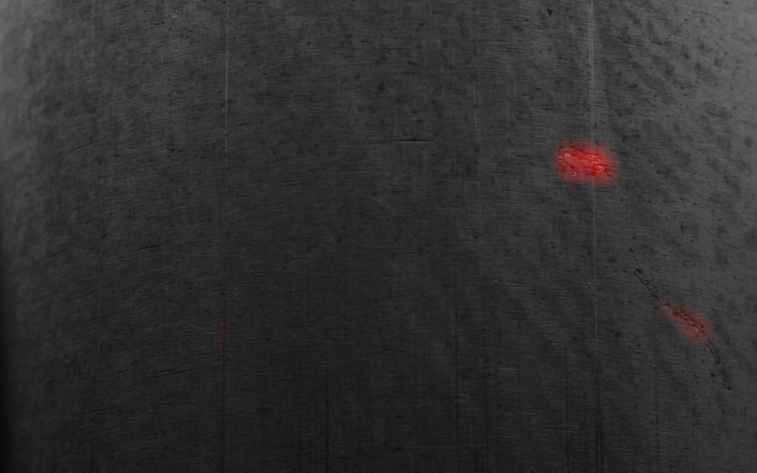
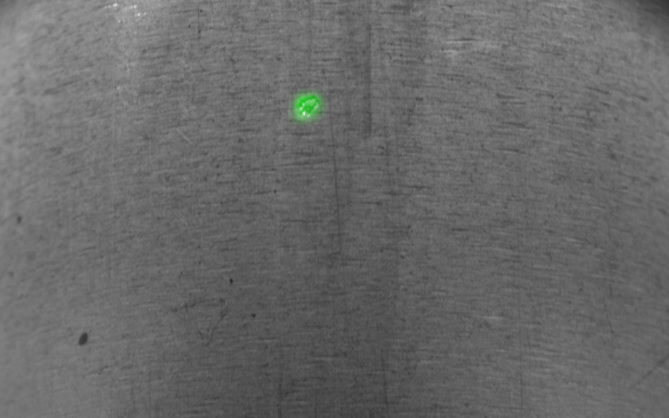
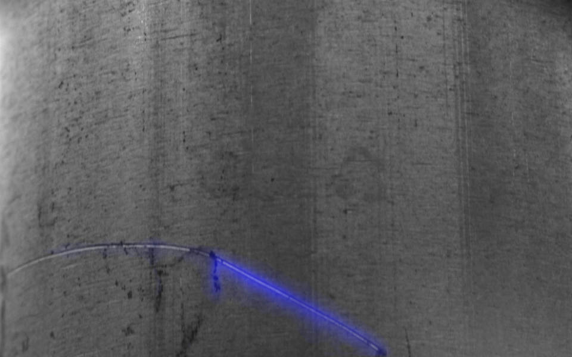

# RosAtomHack_PipeDefect_Detection

## Краткое описание решения:
Разработана двухстадийная система по нахождению и классификации дефектов на поверхности изделий. 
Демонстрирует возможность автоматизации сложного технического процесса для сокращения процента брака при производстве.
## Технические особенности:
Python, OpenCV, Pytorch, Segmentation Models Pytorch, TensorRT, Fast API, Streamlit, RabbitMQ
## Уникальность:
Предложен подход полуавтоматической разметки данных, модель дообучается на весах с похожей задачи, 
система прогнозирует бинарные маски объектов, а затем их классифицирует минуя предсказание точек, 
дополнительно представлены классы для интеграции с другими системами
